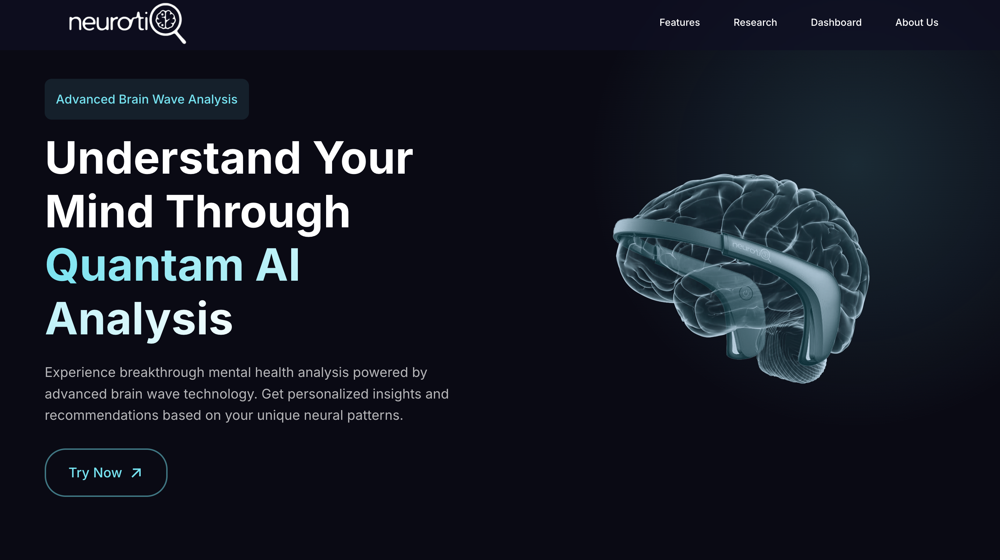
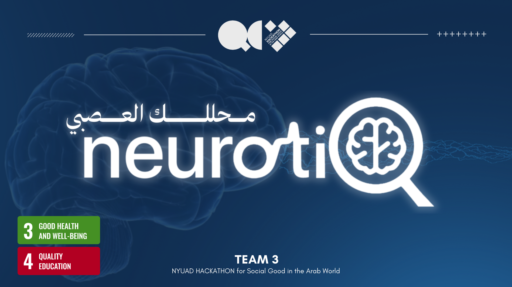

# 🧠 NeurotiQ — Quantum ML for EEG Analysis: Analyzing EEG Brain Signals Using Quantum Support Vector Machines
**NYUAD Social Impact Hackathon 2025**  

## Overview  

NeurotiQ leverages **Quantum Machine Learning (QML)** to improve EEG-based diagnosis of depression and anxiety. Our quantum models identify neurological patterns missed by classical approaches.  

**Core Tech:** `Qiskit`, `PennyLane`, `TensorFlow`, `Scikit-learn`  

---

## Key Components  
### 🔬 Models  
**Quantum (QML):**  
- **QSVM:** Quantum kernel for enhanced separability  (Main Model)
- **QNN:** Quantum Neural Network with amplitude encoding + hybrid architecture  (For Benchmarking reasons)


**Classical (Baseline):**  
- SVM & Logistic Regression  

### 📊 Results  
| Model              | Anxiety (AUC/Accuracy) | Depression (AUC/Accuracy) |  
|--------------------|------------------------|---------------------------|  
| Classical          | 68% / 38%              | 68% / 69%                 |  
| **Quantum QSVM**   | **79% / 81%**          | **73% / 70%**             |  

### 🗃️ Datasets  
1. [Anxiety EEG Dataset](https://www.kaggle.com/datasets/danielesayuriono/eeg-signals-for-anxiety-levels-detection)  
2. [Depression EEG Dataset](https://zenodo.org/records/13690792)  

---

## 🚀 Brain Waves Analyzer App  
**Web App:** [neurotiq.vercel.app](https://neurotiq.vercel.app/)  
AI-powered mental health analysis with GPT-4 integration.  
### Features  
- EEG-based diagnosis for 5 conditions  
- Interactive visualizations & secure reports  
- Emotional support chatbot & self-care tips
  




### ⚙️ Setup  
```bash
git clone https://github.com/yourusername/neurotiq.git
pip install -r requirements.txt
export OPENAI_API_KEY="your_key"  # Linux/macOS
streamlit run disease_checker_app1.py
```

---

## Team  
**NeurotiQ** – NYU Abu Dhabi researchers pioneering quantum AI for mental health.  
