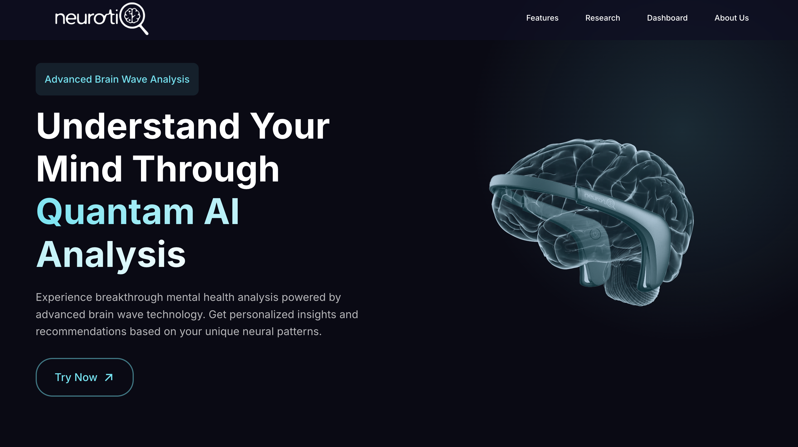
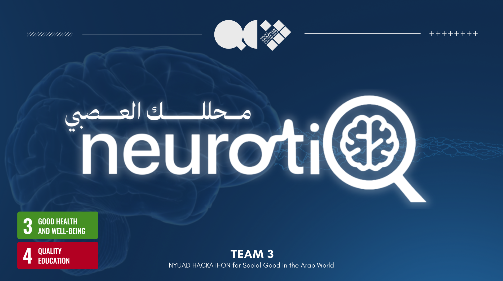

# NeurotiQ — Quantum ML for EEG Analysis
Welcome to the NeurotiQ repository—a collaborative space for quantum EEG analysis, machine learning, and benchmarking. This project is part of the NYUAD Social Impact Hackathon 2025.

## Features
- **Quantum Machine Learning Models:** QSVM (main), QNN (benchmark), classical SVM & logistic regression baselines.
- **EEG Data Analysis:** Quantum and classical models for depression and anxiety detection.
- **Noise & Fidelity Characterization:** Analyze hardware-induced noise, decoherence, and gate errors, visualizing their impact on EEG-based diagnosis.
- **Machine Learning Verification:** Classify and verify EEG signals using SVM, logistic regression, and quantum models, achieving high accuracy.
- **Entropy Extraction & Postprocessing:** Clean and extract high-entropy features for robust diagnosis.
- **Real-World Benchmarking:** Apply quantum models to real EEG datasets and compare with classical approaches.
- **Data Generation & Analysis:** Generate, process, and analyze EEG datasets, with scripts and notebooks for reproducibility.

## Project Stages
1. **DataGeneration:** Generate EEG datasets and preprocess for quantum/classical models.
2. **Stage1:** Implement and test quantum/classical ML algorithms (QSVM, QNN, SVM, Logistic Regression).
3. **Stage2:** Train and evaluate classifiers for anxiety and depression detection.
4. **Stage3:** Analyze noise, fidelity, and quantum hardware effects on EEG analysis.
5. **Stage4:** Extract entropy and postprocess features for improved diagnosis.
6. **Stage5:** Final classification, benchmarking, and verification.

## Results
| Model              | Anxiety (AUC/Accuracy) | Depression (AUC/Accuracy) |
|--------------------|------------------------|---------------------------|
| Classical          | 68% / 38%              | 68% / 69%                 |
| **Quantum QSVM**   | **79% / 81%**          | **73% / 70%**             |

## Datasets
1. [Anxiety EEG Dataset](https://www.kaggle.com/datasets/danielesayuriono/eeg-signals-for-anxiety-levels-detection)
2. [Depression EEG Dataset](https://zenodo.org/records/13690792)

## Web App
**Brain Waves Analyzer App:** [neurotiq.vercel.app](https://neurotiq.vercel.app/)
AI-powered mental health analysis with GPT-4 integration.
### Features
- EEG-based diagnosis for 5 conditions
- Interactive visualizations & secure reports
- Emotional support chatbot & self-care tips




## How to Use This Repository
1. **Clone the repository:**
	```bash
	git clone https://github.com/yourusername/neurotiq.git
	```
2. **Install dependencies:**
	```bash
	pip install -r requirements.txt
	```
3. **Set up API keys (if needed):**
	```bash
	export OPENAI_API_KEY="your_key"  # Linux/macOS
	```
4. **Run the app:**
	```bash
	streamlit run disease_checker_app1.py
	```
5. **Explore notebooks and scripts:**
	Use Jupyter Notebook or VS Code to run .ipynb files and Python scripts in each stage.